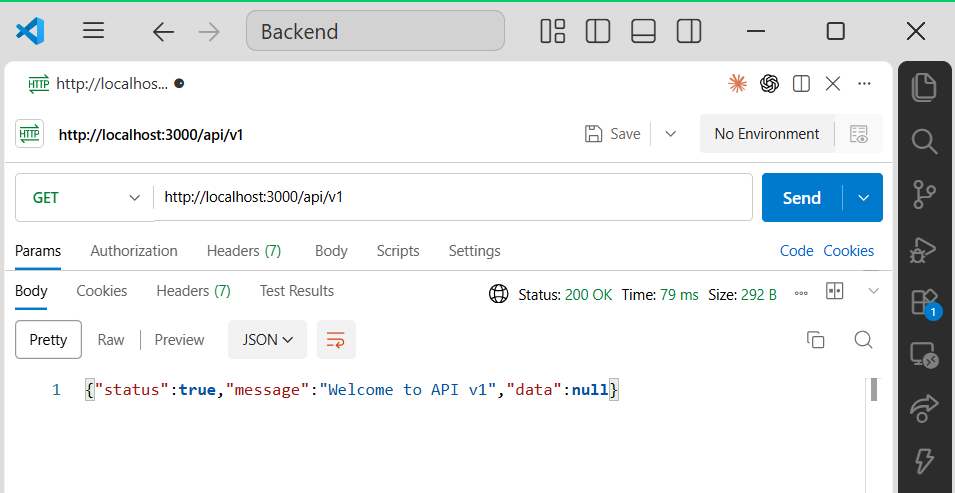
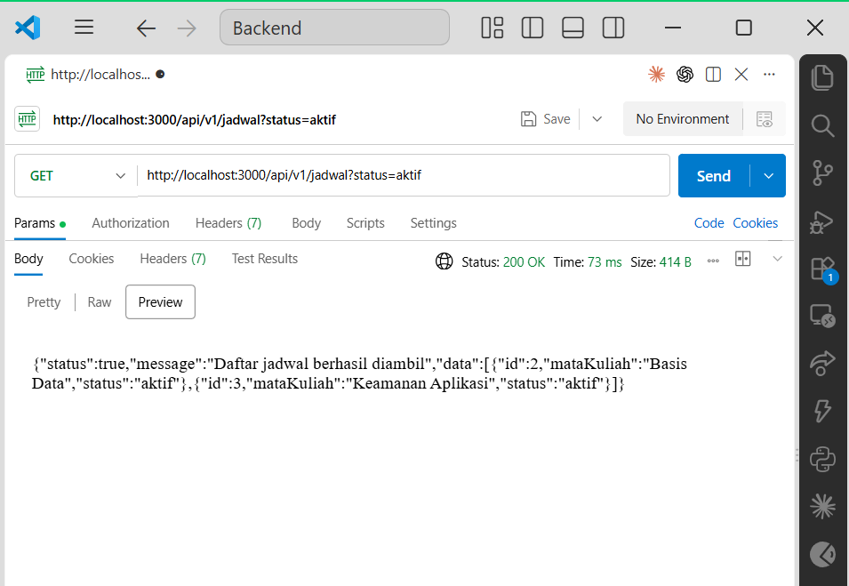
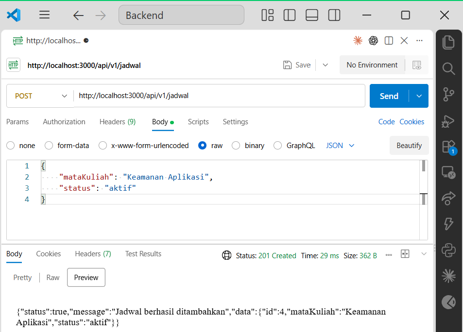
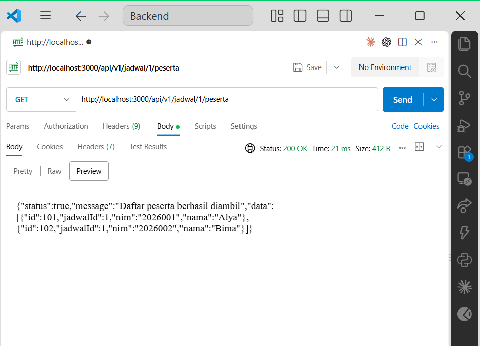
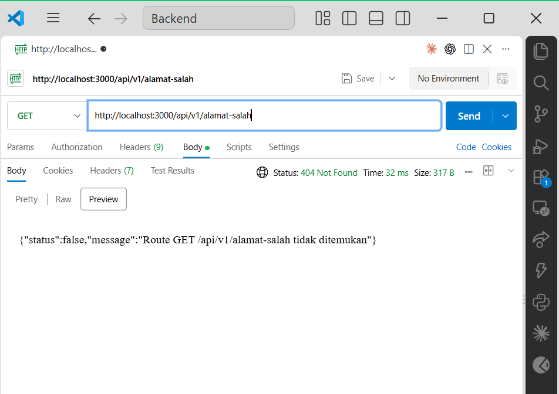
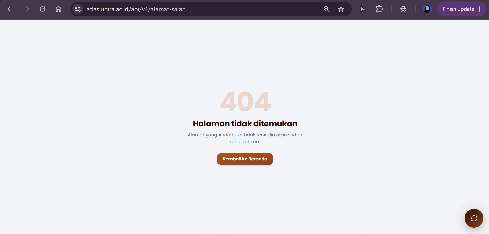

#Dokumentasi Routing API -Pertemuan 2

Dokumentasi ini berisi hasil implementasi dan pengujian routing backend menggunakan Express.js pada Pertemuan 2 Pemrograman Berbasis Platform. Backend menggunakan data mock berbentuk array agar pengujian difokuskan pada routing, HTTP method, parameter, query, body request, nested route, dan HTTP status code.

------

##1. Identitas

- **Kelompok:** Keren
- **Anggota:**
    - Anisa Triyana - 2024520034 - Keren
    - Ach. Nur Maulidi - 2024520061 - Keren
    - Achmed Abdillah - 2024520082 - Keren
    - Ahmad Hamdani - 2024520019 - Keren
- **Repository Github:** Nama Repo
- **Base URL Lokal:** http://localhost:3000/api/v1

## 2. Gambar Acuan Arsitektur

### 2.1 Alur Praktikum Express


**Gambar 1.** Alur praktikum Express mulai dari inisialisasi proyek, instalasi Express, pembuatan server, data mock, router, nested route, hingga proses pengujian API.

### 2.2 Komposisi Prefix dan Nested Route


**Gambar 2.** Komposisi route Express yang menggabungkan prefix `/api/v1`, resource `/jadwal`, dan path pada router sehingga membentuk URL akhir API.

### 2.3 Alur Frontend dan Backend


**Gambar 3.** Gambaran komunikasi antara frontend dan backend. Frontend mengirim request kepada backend, kemudian backend memproses permintaan dan mengembalikan response kepada client.

---

## 3. Struktur Akhir Backend

Struktur backend setelah seluruh tahap praktikum selesai adalah sebagai berikut:

```text
backend/
├── package.json
├── package-lock.json
└── src/
    ├── app.js
    ├── server.js
    ├── data/
    │   └── mock.js
    └── routes/
        ├── index.js
        ├── jadwal.js
        └── peserta.js
```

File `app.js` berfungsi untuk melakukan konfigurasi aplikasi Express dan memasang router utama pada prefix `/api/v1`.

File `server.js` berfungsi menjalankan HTTP server pada port `3000`.

File `mock.js` menyimpan data sementara `jadwal` dan `peserta` dalam bentuk array.

File `index.js` menjadi router utama API, sedangkan `jadwal.js` menangani resource jadwal dan `peserta.js` menangani nested resource peserta.

---

## 4. Daftar Route API

| Method | URL | Asal Input | Status Sukses | Status Gagal |
|---|---|---|---|---|
| GET | `/api/v1` | — | `200` Welcome | — |
| GET | `/api/v1/jadwal` | `req.query` | `200` daftar jadwal | — |
| GET | `/api/v1/jadwal/jumlah-jadwal` | Array jadwal | `200` jumlah jadwal | — |
| GET | `/api/v1/jadwal/:id` | `req.params.id` | `200` satu jadwal | `400` ID bukan angka, `404` jadwal tidak ditemukan |
| POST | `/api/v1/jadwal` | `req.body` | `201` jadwal ditambahkan | `400` `mataKuliah` kosong |
| PUT | `/api/v1/jadwal/:id` | `req.params` + `req.body` | `200` jadwal diperbarui | `404` jadwal tidak ditemukan |
| DELETE | `/api/v1/jadwal/:id` | `req.params.id` | `200` jadwal dihapus | `404` jadwal tidak ditemukan |
| GET | `/api/v1/jadwal/:jadwalId/peserta` | Parameter induk | `200` daftar peserta | `404` jadwal induk tidak ditemukan |
| POST | `/api/v1/jadwal/:jadwalId/peserta` | Parameter induk + `req.body` | `201` peserta ditambahkan | `400` body tidak lengkap, `404` jadwal tidak ditemukan |
| GET | `/api/v1/jadwal/:jadwalId/peserta/:pesertaId` | Dua route parameter | `200` peserta ditemukan | `404` peserta tidak berada pada jadwal tersebut |

### Catatan Routing

Route `/jumlah-jadwal` diletakkan sebelum route dinamis `/:id`. Hal tersebut dilakukan agar string `jumlah-jadwal` tidak dianggap sebagai nilai parameter `id`.

Pada nested route peserta digunakan:

```javascript
express.Router({ mergeParams: true })
```

Penggunaan `mergeParams: true` memungkinkan router peserta membaca parameter `jadwalId` yang berasal dari router induk.

---

## 5. Hasil Pengujian API

Pengujian dilakukan terhadap delapan skenario utama untuk memastikan routing, query parameter, route parameter, body request, nested route, dan error handling bekerja sesuai rancangan.

| No. | Request | Harapan | Hasil Aktual |
|---:|---|---|---|
| 1 | `GET /api/v1` | `200`, pesan welcome | `200`, API memberikan pesan `Welcome to API v1` |
| 2 | `GET /api/v1/jadwal?status=aktif` | `200`, hanya data aktif | `200`, hanya jadwal dengan status `aktif` yang ditampilkan |
| 3 | `GET /api/v1/jadwal/abc` | `400`, ID harus angka | `400`, muncul pesan `id harus berupa angka` |
| 4 | `GET /api/v1/jadwal/99` | `404`, jadwal tidak ditemukan | `404`, muncul pesan `Jadwal tidak ditemukan` |
| 5 | `POST /api/v1/jadwal` dengan body valid | `201`, objek baru | `201`, jadwal baru berhasil ditambahkan |
| 6 | `GET /api/v1/jadwal/1/peserta` | `200`, peserta jadwal 1 | `200`, peserta pada jadwal 1 berhasil ditampilkan |
| 7 | `GET /api/v1/jadwal/1/peserta/103` | `404`, peserta berada di jadwal lain | `404`, muncul pesan `Peserta tidak ditemukan pada jadwal ini` |
| 8 | `GET /api/v1/alamat-salah` | `404`, fallback route | `404`, route yang tidak terdaftar ditangani oleh fallback route |

> **Catatan:** Kolom hasil aktual di atas digunakan apabila hasil pengujian lokal sama dengan hasil yang telah diperoleh. Jika terdapat hasil berbeda pada terminal atau Postman, isi tabel harus mengikuti hasil pengujian sebenarnya.

---

## 6. Contoh Response API

### 6.1 GET Welcome API

Request:

```http
GET /api/v1
```

Response:

```json
{
  "status": true,
  "message": "Welcome to API v1",
  "data": null
}
```

Status:

```text
200 OK
```

---

### 6.2 GET Jadwal dengan Filter

Request:

```http
GET /api/v1/jadwal?status=aktif
```

Query parameter:

```text
status=aktif
```

Contoh response:

```json
{
  "status": true,
  "message": "Daftar jadwal berhasil diambil",
  "data": [
    {
      "id": 1,
      "mataKuliah": "Pemrograman Berbasis Platform",
      "status": "aktif"
    },
    {
      "id": 2,
      "mataKuliah": "Basis Data",
      "status": "aktif"
    }
  ]
}
```

Status:

```text
200 OK
```

Pengujian menunjukkan bahwa `req.query.status` berhasil digunakan untuk memfilter data sehingga hanya jadwal dengan status `aktif` yang dikembalikan.

---

### 6.3 GET Jadwal dengan ID Tidak Valid

Request:

```http
GET /api/v1/jadwal/abc
```

Response:

```json
{
  "status": false,
  "message": "id harus berupa angka"
}
```

Status:

```text
400 Bad Request
```

Response `400` digunakan karena nilai parameter `id` yang diberikan oleh client tidak sesuai dengan format yang diharapkan.

---

### 6.4 GET Jadwal yang Tidak Tersedia

Request:

```http
GET /api/v1/jadwal/99
```

Response:

```json
{
  "status": false,
  "message": "Jadwal tidak ditemukan"
}
```

Status:

```text
404 Not Found
```

Status `404` menunjukkan bahwa format request sudah benar, tetapi resource dengan ID tersebut tidak tersedia.

---

### 6.5 POST Jadwal

Request:

```http
POST /api/v1/jadwal
```

Body:

```json
{
  "mataKuliah": "Keamanan Aplikasi",
  "status": "aktif"
}
```

Contoh response:

```json
{
  "status": true,
  "message": "Jadwal berhasil ditambahkan",
  "data": {
    "id": 4,
    "mataKuliah": "Keamanan Aplikasi",
    "status": "aktif"
  }
}
```

Status:

```text
201 Created
```

Status `201 Created` menunjukkan bahwa resource jadwal baru berhasil dibuat.

---

### 6.6 GET Nested Route Peserta

Request:

```http
GET /api/v1/jadwal/1/peserta
```

Contoh response:

```json
{
  "status": true,
  "message": "Daftar peserta berhasil diambil",
  "data": [
    {
      "id": 101,
      "jadwalId": 1,
      "nim": "2026001",
      "nama": "Alya"
    },
    {
      "id": 102,
      "jadwalId": 1,
      "nim": "2026002",
      "nama": "Bima"
    }
  ]
}
```

Status:

```text
200 OK
```

Route tersebut merupakan nested route karena resource `peserta` diakses dalam konteks resource induk `jadwal`.

---

### 6.7 GET Peserta pada Jadwal yang Salah

Request:

```http
GET /api/v1/jadwal/1/peserta/103
```

Response:

```json
{
  "status": false,
  "message": "Peserta tidak ditemukan pada jadwal ini"
}
```

Status:

```text
404 Not Found
```

Peserta dengan ID `103` memang terdapat pada data mock, tetapi peserta tersebut memiliki `jadwalId = 2`. Oleh karena itu, ketika peserta `103` dicari melalui jadwal `1`, API mengembalikan `404`.

---

### 6.8 Fallback Route

Request:

```http
GET /api/v1/alamat-salah
```

Contoh response:

```json
{
  "status": false,
  "message": "Route GET /api/v1/alamat-salah tidak ditemukan"
}
```

Status:

```text
404 Not Found
```

Fallback route digunakan untuk menangani alamat API yang tidak terdaftar pada aplikasi.

---

## 7. Bukti Screenshot Pengujian

### 7.1 Welcome API

Pengujian `GET /api/v1` berhasil mengembalikan status `200`.



**Gambar 4.** Hasil pengujian endpoint welcome API.

---

### 7.2 Filter Query Jadwal

Pengujian:

```text
GET /api/v1/jadwal?status=aktif
```

menunjukkan bahwa API hanya mengembalikan jadwal yang memiliki status `aktif`.



**Gambar 5.** Hasil pengujian query parameter `status=aktif`.

---

### 7.3 POST Jadwal

Pengujian `POST /api/v1/jadwal` dengan body valid berhasil membuat data baru dan mengembalikan status `201 Created`.



**Gambar 6.** Hasil pengujian penambahan jadwal.

---

### 7.4 Nested Route Peserta

Pengujian:

```text
GET /api/v1/jadwal/1/peserta
```

berhasil menampilkan peserta yang memiliki `jadwalId = 1`.



**Gambar 7.** Hasil pengujian nested route peserta.

---

### 7.5 Pengujian Negatif

Pengujian negatif dilakukan untuk memastikan backend dapat menangani request yang tidak sesuai atau resource yang tidak ditemukan.



**Gambar 8.** Salah satu hasil pengujian negatif dengan status `400` atau `404`.

---

## 8. Perbandingan Backend Lokal dengan ATLAS

Pada backend latihan, request terhadap route yang tidak terdaftar ditangani menggunakan status `404 Not Found`. Penggunaan status tersebut sesuai dengan makna HTTP bahwa resource atau alamat yang diminta tidak ditemukan.

Contoh pada backend lokal:

```text
GET /api/v1/alamat-salah
```

menghasilkan fallback route dengan status:

```text
404 Not Found
```

Menurut dokumentasi modul Pertemuan 2, sistem ATLAS pada implementasi lama memiliki perilaku yang berbeda. Path API yang tidak cocok dapat menghasilkan status `500` dengan pesan `Api tidak tersedia`.

Namun, pada pengujian terhadap ATLAS yang dilakukan saat praktikum menggunakan alamat:

```text
https://atlas.unira.ac.id/api/v1/alamat-salah
```

sistem yang sedang berjalan menampilkan halaman:

```text
404
Halaman tidak ditemukan
Alamat yang Anda buka tidak tersedia atau sudah dipindahkan.
```

Dengan demikian terdapat perbedaan antara perilaku ATLAS lama yang dijelaskan pada modul dan tampilan ATLAS yang diperoleh pada saat pengujian.

Backend latihan tidak diubah menjadi `500`, karena status `404` lebih tepat secara semantik untuk menunjukkan bahwa route atau resource yang diminta tidak ditemukan.

### Bukti Pengujian ATLAS



**Gambar 9.** Tampilan ATLAS ketika alamat API yang tidak tersedia diakses.

> Catatan: pengujian melalui browser menunjukkan halaman bertuliskan `404`. Untuk memastikan HTTP status code yang dikirim server secara langsung, pengujian dapat diperkuat menggunakan `curl -i`.

---

## 9. Analisis HTTP Status Code

Berdasarkan hasil pengujian, beberapa HTTP status code yang digunakan pada backend adalah:

| Status | Makna | Contoh pada Praktikum |
|---|---|---|
| `200 OK` | Request berhasil diproses | GET jadwal, GET peserta, PUT dan DELETE |
| `201 Created` | Resource baru berhasil dibuat | POST jadwal dan POST peserta |
| `400 Bad Request` | Request client tidak valid | ID bukan angka atau body tidak lengkap |
| `404 Not Found` | Resource atau route tidak ditemukan | Jadwal tidak ada, peserta salah jadwal, alamat salah |

Penggunaan status code membantu client mengetahui hasil request tanpa hanya bergantung pada isi pesan response.

---

## 10. Kesimpulan

Praktikum Pertemuan 2 menunjukkan bahwa routing pada Express.js tidak hanya menentukan alamat endpoint, tetapi juga menghubungkan HTTP method, URL, parameter, query string, body request, serta handler yang sesuai.

Route statis dan dinamis harus disusun dengan urutan yang tepat agar tidak terjadi konflik. Query parameter digunakan untuk melakukan filter data, route parameter digunakan untuk menentukan resource tertentu, sedangkan request body digunakan untuk mengirim data ketika melakukan operasi penambahan atau perubahan.

Nested route memungkinkan resource peserta ditempatkan dalam konteks jadwal tertentu. Penggunaan `mergeParams: true` diperlukan agar parameter dari router induk dapat dibaca oleh router anak.

Hasil pengujian juga menunjukkan pentingnya penggunaan HTTP status code yang sesuai. Response `2xx` menunjukkan operasi berhasil, `400` digunakan untuk request yang tidak valid, sedangkan `404` digunakan ketika resource atau route tidak ditemukan.

---

## 11. Kendala dan Penyelesaian

| Gejala / Kendala | Penyebab | Solusi |
|---|---|---|
| Route yang salah harus ditangani dengan benar | Alamat tidak terdaftar pada router | Menggunakan fallback route dengan response `404` |
| Parameter `jadwalId` perlu diteruskan ke router peserta | Router peserta merupakan child router | Menggunakan `express.Router({ mergeParams: true })` |
| `/jumlah-jadwal` berpotensi dianggap sebagai nilai `id` | Route dinamis `/:id` dapat menangkap path tersebut | Meletakkan `/jumlah-jadwal` sebelum `/:id` |
| Data POST hilang setelah server direstart | Data masih disimpan pada array di memori | Diterima sebagai perilaku praktikum Pertemuan 2; database digunakan pada pertemuan berikutnya |
