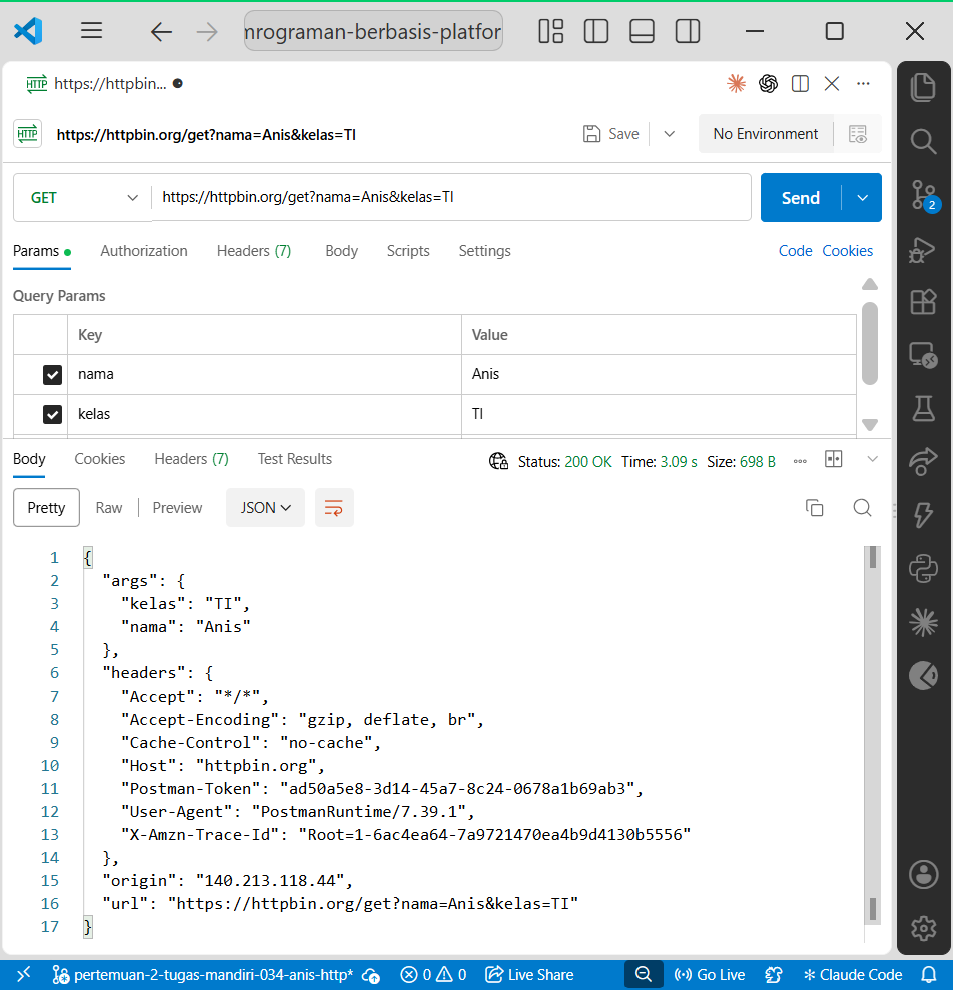
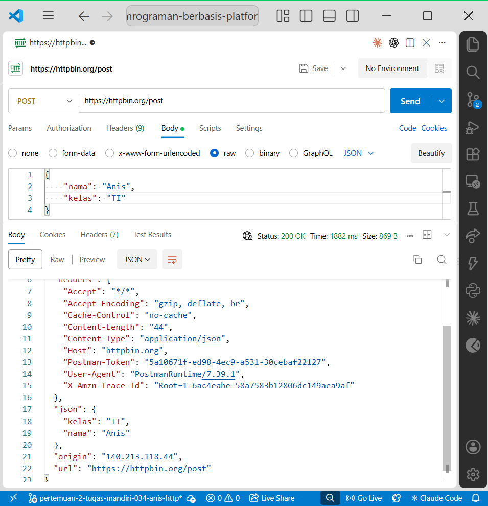

# Tugas Mandiri 1 — Mengenal HTTP Method dan Endpoint

## Identitas

- Nama: Ulid
- NIM: 061
- Pertemuan: 2
- Mata Kuliah: Pemrograman Berbasis Platform

## Tujuan

Tugas ini bertujuan memahami hubungan antara HTTP method, endpoint, parameter, request, dan response dengan melakukan pengujian API menggunakan HTTPBin.

## Hasil Pengujian

| No | Method | Endpoint | Data yang dikirim | Status | Hasil |
|---:|---|---|---|---:|---|
| 1 | GET | `/get` | Query parameter `nama=Anis&kelas=TI` | 200 | Server menerima query parameter dan mengembalikannya pada bagian `args` |
| 2 | POST | `/post` | JSON body berisi nama dan kelas | 200 | Server menerima data JSON dan mengembalikannya pada bagian `json` |
| 3 | PUT | `/put` | JSON body berisi nama, kelas, dan status | 200 | Server menerima data yang dikirim melalui request body |
| 4 | PATCH | `/patch` | JSON body berisi perubahan status | 200 | Server menerima data perubahan sebagian melalui request body |
| 5 | DELETE | `/delete` | Tidak ada | 200 | Server menerima request DELETE dan mengembalikan informasi request |

## 1. GET

**HTTP Method:** GET  
**URL:** `https://httpbin.org/get?nama=Anis&kelas=TI`  
**Tujuan:** Mengambil data sekaligus menguji pengiriman query parameter.  
**Data yang dikirim:** `nama=Anis` dan `kelas=TI`.  
**Status Code:** `200 OK`.

Response menunjukkan bahwa query parameter yang dikirim client diterima server dan dikembalikan pada bagian `args`.



## 2. POST

**HTTP Method:** POST  
**URL:** `https://httpbin.org/post`  
**Tujuan:** Menguji pengiriman data melalui request body.  
**Data yang dikirim:**

```json
{
  "nama": "Anis",
  "kelas": "TI"
}




Lalu PUT:

```markdown
## 3. PUT

**HTTP Method:** PUT  
**URL:** `https://httpbin.org/put`  
**Tujuan:** Menguji request untuk memperbarui atau mengganti data.  
**Data yang dikirim:**

```json
{
  "nama": "Anis",
  "kelas": "TI",
  "status": "diperbarui"
}

PATCH:

```markdown
## 4. PATCH

**HTTP Method:** PATCH  
**URL:** `https://httpbin.org/patch`  
**Tujuan:** Menguji perubahan sebagian data.  
**Data yang dikirim:**

```json
{
  "status": "aktif"
}


DELETE:

```markdown
## 5. DELETE

**HTTP Method:** DELETE  
**URL:** `https://httpbin.org/delete`  
**Tujuan:** Menguji request penghapusan resource.  
**Data yang dikirim:** Tidak ada.  
**Status Code:** `200 OK`.

Server menerima request DELETE dan mengembalikan informasi mengenai request yang diterima.

## Kesimpulan
Berdasarkan pengujian, setiap HTTP method memiliki fungsi yang berbeda. GET digunakan untuk mengambil data, POST untuk mengirim atau membuat data baru, PUT untuk memperbarui data secara keseluruhan, PATCH untuk memperbarui sebagian data, sedangkan DELETE digunakan untuk menghapus data. HTTPBin membantu melihat kembali informasi request yang dikirim sehingga hubungan antara method, endpoint, request, dan response dapat diamati secara langsung.