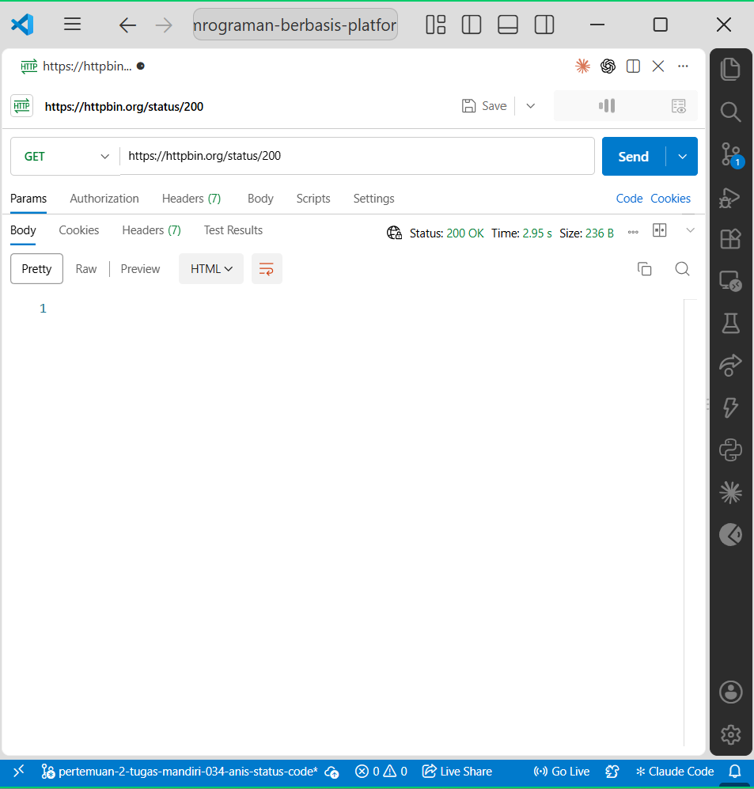
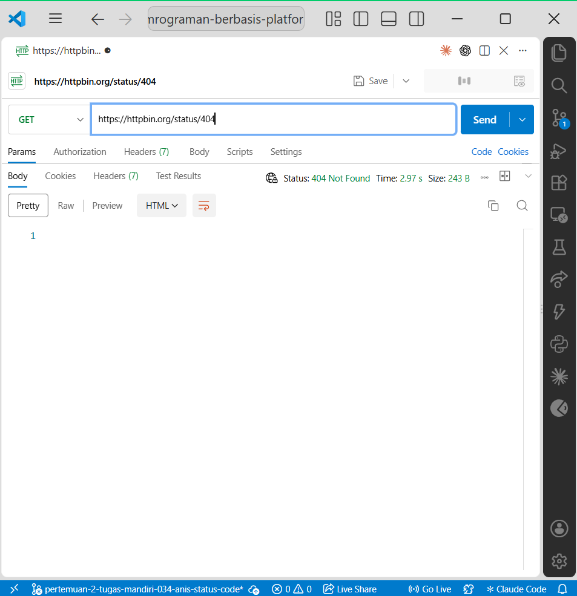
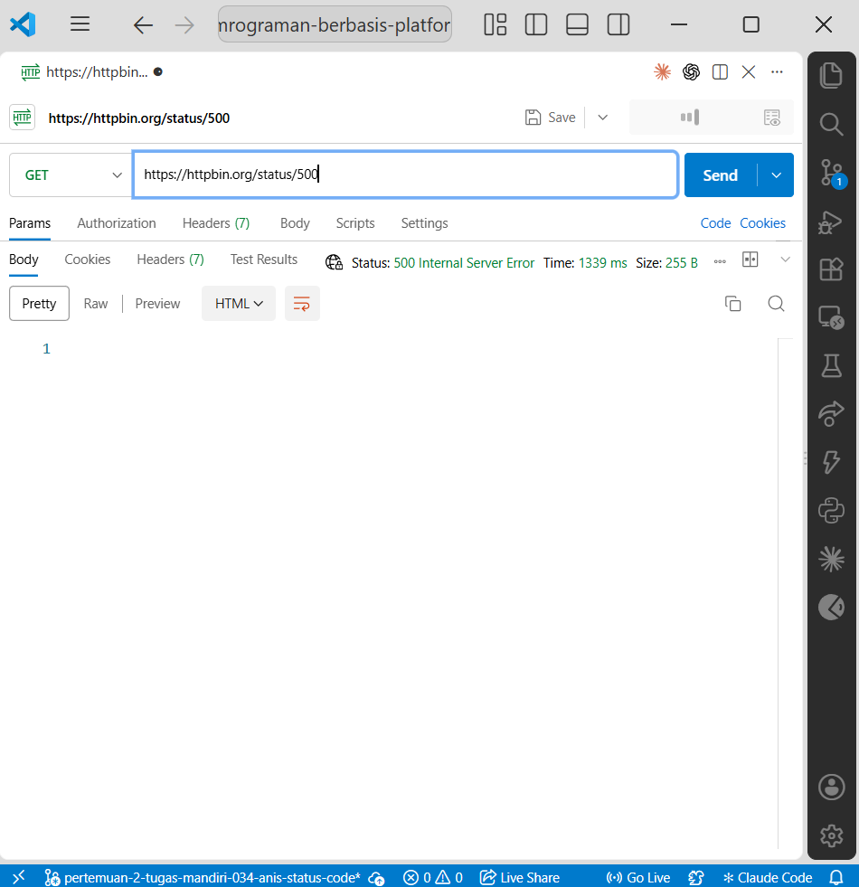

# Tugas Mandiri 2 — Memahami HTTP Status Code

## Identitas

- Nama: ulid
- NIM: 2024520061
- Pertemuan: 2
- Mata Kuliah: Pemrograman Berbasis Platform

## Tujuan

Tugas ini bertujuan memahami arti HTTP status code yang diberikan server ketika menerima dan memproses request dari client.

## Hasil Pengujian

| Status Code | Arti | Hasil Pengujian | Kapan Digunakan |
|---|---|---|---|
| 200 | OK | Server mengembalikan `200 OK` | Ketika request berhasil diproses |
| 201 | Created | Server mengembalikan `201 Created` | Ketika resource baru berhasil dibuat |
| 400 | Bad Request | Server mengembalikan `400 Bad Request` | Ketika request dari client tidak valid |
| 401 | Unauthorized | Server mengembalikan `401 Unauthorized` | Ketika autentikasi diperlukan atau tidak valid |
| 403 | Forbidden | Server mengembalikan `403 Forbidden` | Ketika client dikenali tetapi tidak memiliki izin |
| 404 | Not Found | Server mengembalikan `404 Not Found` | Ketika resource atau endpoint tidak ditemukan |
| 500 | Internal Server Error | Server mengembalikan `500 Internal Server Error` | Ketika terjadi kegagalan pada sisi server |

## Pertanyaan dan Jawaban

### 1. Apa perbedaan 400 dan 404?

Status `400 Bad Request` menunjukkan bahwa request yang dikirim client tidak dapat diproses karena format, parameter, atau data yang diberikan tidak sesuai dengan kebutuhan server.

Sedangkan `404 Not Found` menunjukkan bahwa request dapat dipahami oleh server, tetapi resource atau alamat yang diminta tidak ditemukan.

Contohnya, data pada body yang tidak valid dapat menghasilkan `400`, sedangkan mengakses endpoint yang tidak tersedia dapat menghasilkan `404`.

### 2. Apa perbedaan 401 dan 403?

Status `401 Unauthorized` digunakan ketika client belum memberikan autentikasi yang valid, misalnya token login tidak ada atau tidak sah.

Status `403 Forbidden` digunakan ketika identitas client sudah diketahui, tetapi client tersebut tidak memiliki hak atau izin untuk mengakses resource yang diminta.

Dengan demikian, `401` berkaitan dengan autentikasi, sedangkan `403` berkaitan dengan otorisasi.

### 3. Mengapa 500 menunjukkan masalah pada sisi server?

Status `500 Internal Server Error` menunjukkan bahwa server mengalami kesalahan ketika memproses request. Kesalahan tersebut dapat disebabkan oleh bug pada program, kegagalan koneksi database, exception yang tidak ditangani, atau masalah internal lainnya.

Karena sumber masalah terjadi pada proses internal server, client biasanya tidak dapat memperbaikinya hanya dengan mengubah request.

### 4. Apakah semua error HTTP berarti server mengalami kerusakan?

Tidak. Tidak semua HTTP error berarti server mengalami kerusakan.

Status pada kelompok `4xx` biasanya menunjukkan masalah yang berasal dari request client, misalnya request tidak valid (`400`), tidak memiliki autentikasi (`401`), tidak memiliki izin (`403`), atau resource tidak ditemukan (`404`).

Sedangkan kelompok `5xx` menunjukkan bahwa server mengalami masalah ketika memproses request.

## Bukti Pengujian

### Status 200 OK

### Status 404 Not Found

### Status 500 Internal Server Error

