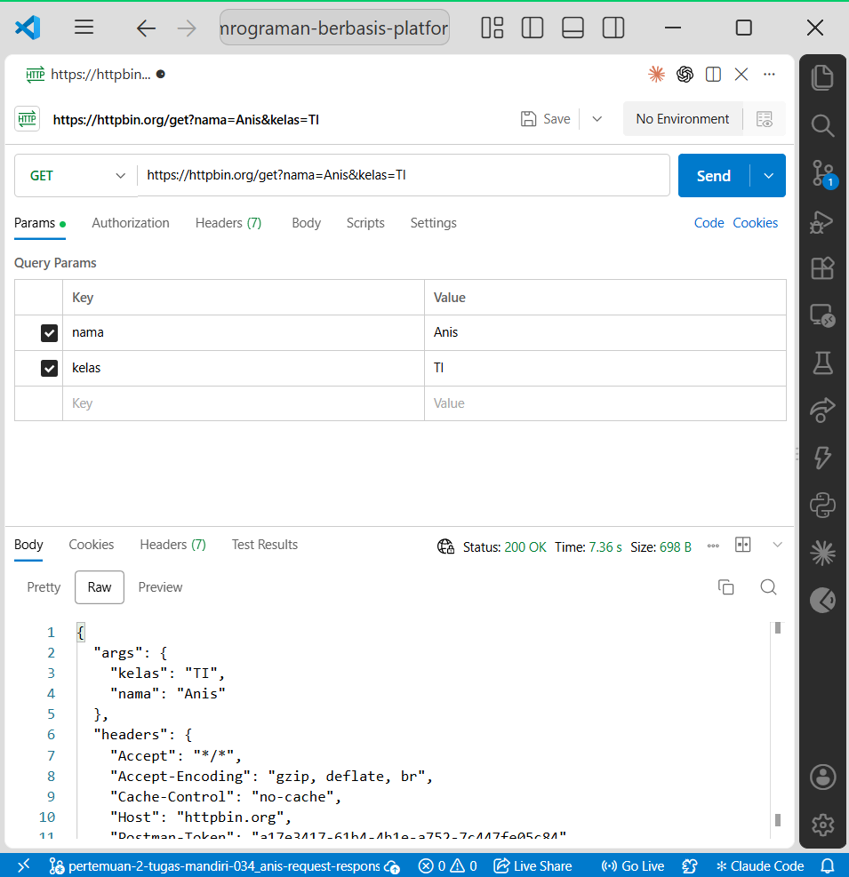
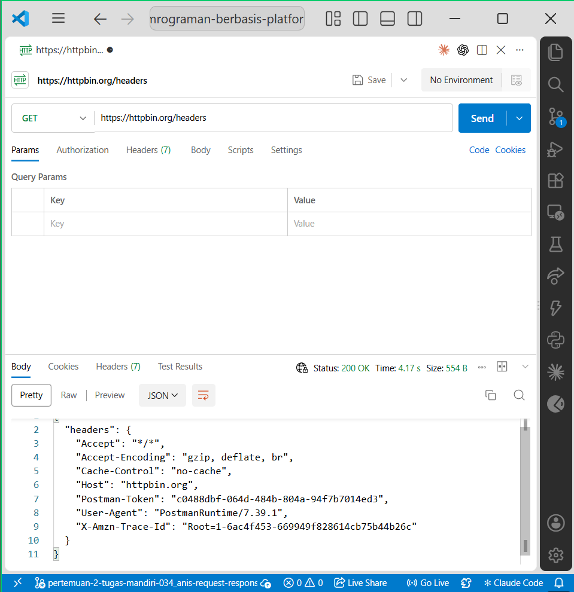

# Tugas Mandiri 3 — Memahami Request dan Response

## Identitas

- Nama: ulid
- NIM: 061
- Pertemuan: 2
- Mata Kuliah: Pemrograman Berbasis Platform

## Tujuan

Tugas ini bertujuan memahami proses komunikasi antara client dan server melalui request dan response, serta memahami fungsi query parameter dan HTTP header.

## Bukti Pengujian

### 1. Response GET dengan Query Parameter



### 2. Response HTTP Headers



## Pengujian Request GET

### GET Tanpa Query Parameter

Request:

```text
GET https://httpbin.org/get


### 7. Jawab 5 pertanyaan modul

Modul mewajibkan **lima pertanyaan ini**. :chatgpt-content-reference{index="5"}

Tambahkan:

```markdown
## Pertanyaan dan Jawaban

### 1. Apa yang dimaksud request?

Request adalah permintaan yang dikirim oleh client kepada server untuk melakukan suatu operasi tertentu. Request dapat berisi HTTP method, URL, header, query parameter, dan request body.

Contohnya:

```text
GET https://httpbin.org/get

### 2. Apa yang dimaksud response?

Response adalah jawaban yang diberikan server setelah menerima dan memproses request dari client.

Response dapat berisi status code, HTTP header, dan response body.
Sebagai contoh, ketika request berhasil diproses, server dapat memberikan status 200 OK beserta data hasil request.

### 3. Apa fungsi query parameter?

Query parameter digunakan untuk mengirimkan informasi tambahan melalui URL.
Query parameter biasanya digunakan untuk melakukan pencarian, filter, pengurutan, atau memberikan kriteria tertentu kepada server.
Contoh:
https://httpbin.org/get?nama=Anis&kelas=TI

### 4. Apa fungsi HTTP header?

HTTP header digunakan untuk membawa informasi tambahan atau metadata mengenai request maupun response.
Header dapat berisi informasi seperti jenis data yang diterima, tipe konten, autentikasi, identitas client, dan informasi lainnya.
Contohnya adalah:
Content-Type: application/json
Authorization: Bearer token
User-Agent: PostmanRuntime

### 5. Apa perbedaan data pada URL dengan data pada request body?

Data pada URL terlihat sebagai bagian dari alamat request, misalnya melalui query parameter.
Contoh:
GET /get?nama=Anis&kelas=TI

Sedangkan request body merupakan data yang dikirim di dalam isi request dan tidak menjadi bagian dari URL.
Request body biasanya digunakan pada method seperti POST, PUT, atau PATCH ketika client ingin mengirim data yang lebih kompleks ke server.
Contohnya:
{
  "nama": "Anis",
  "kelas": "TI"
}

### 8. Kesimpulan


```markdown
## Kesimpulan

Berdasarkan pengujian yang dilakukan, komunikasi antara client dan server berlangsung melalui mekanisme request dan response. Client mengirimkan request yang dapat berisi URL, query parameter, header, atau body. Server menerima dan memproses informasi tersebut kemudian memberikan response.

Query parameter digunakan untuk mengirim data melalui URL, sedangkan HTTP header membawa informasi tambahan mengenai request. Request body digunakan untuk mengirim data di dalam isi request, terutama pada operasi seperti POST, PUT, dan PATCH.