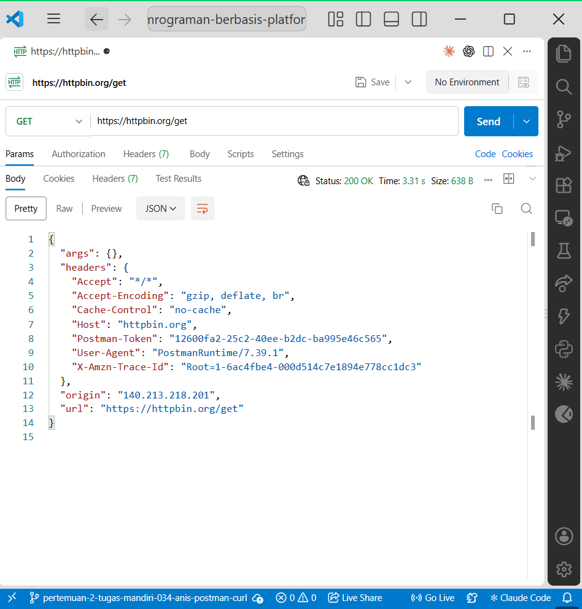
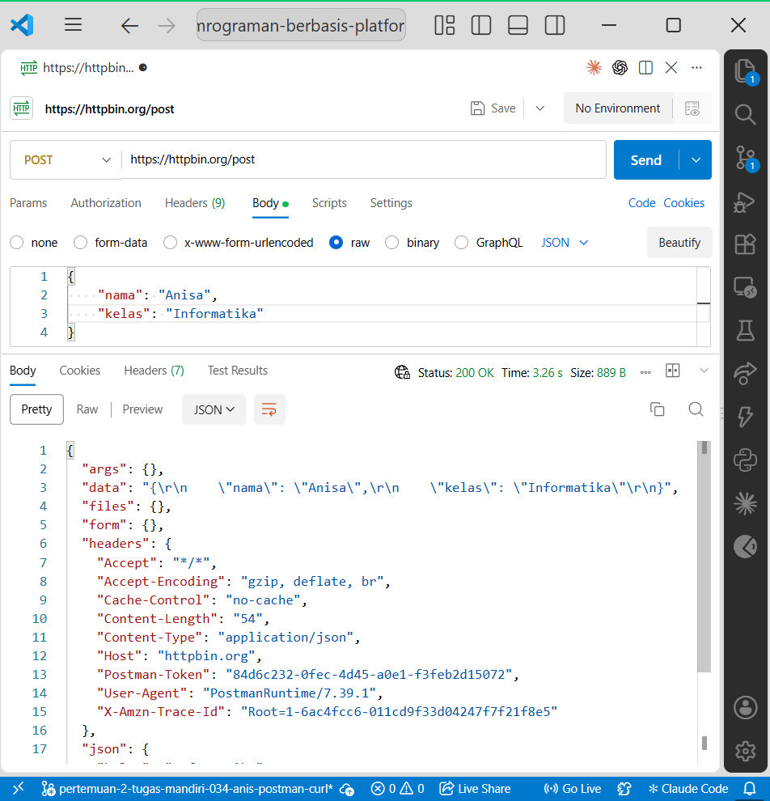
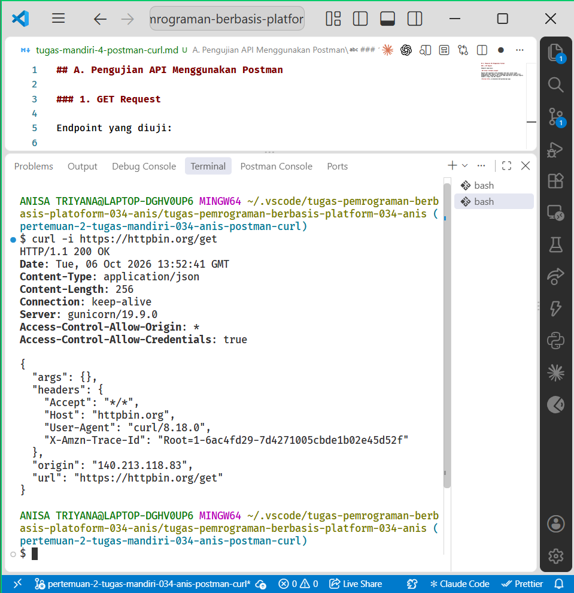
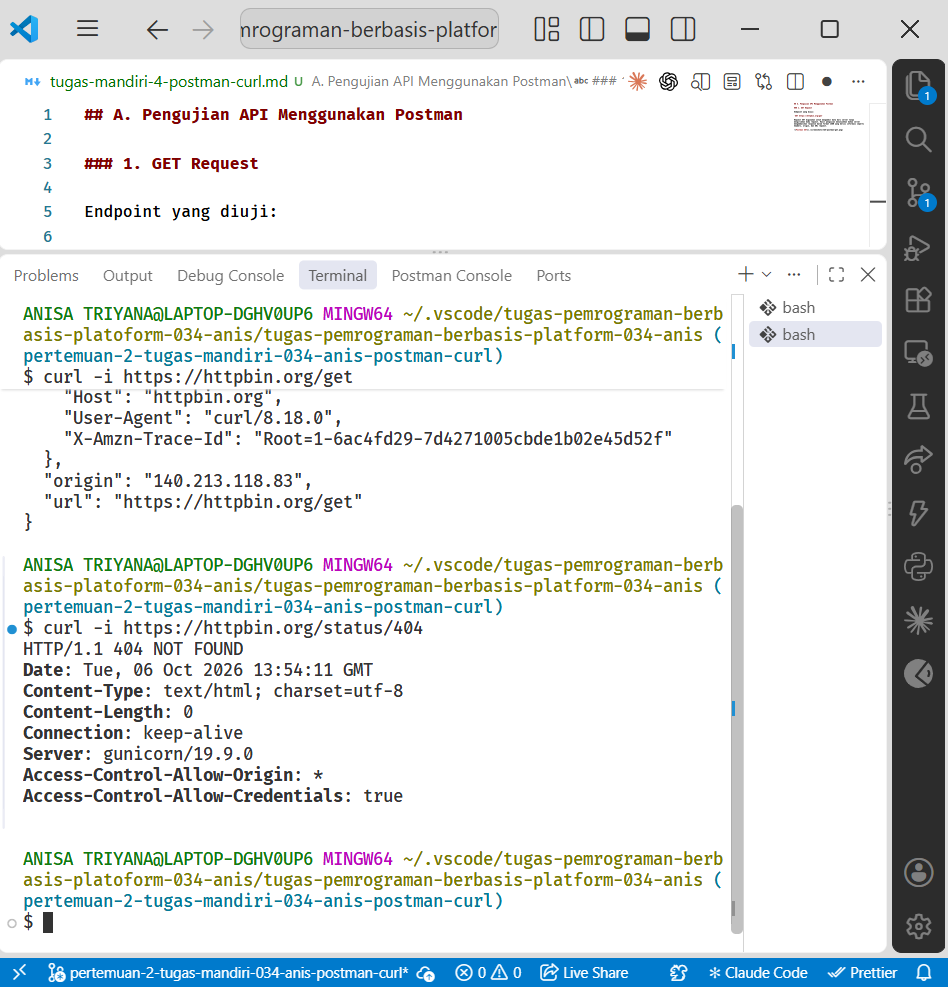
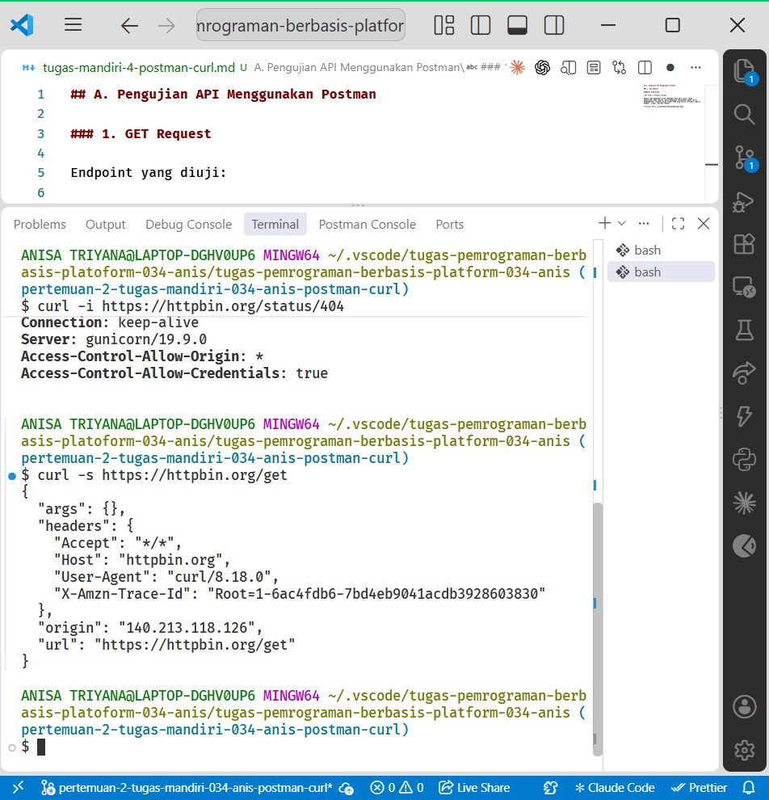

# Tugas Mandiri 4 — Pengujian API dengan Postman dan curl

**Nama:** ulid
**NIM:** 061
**Pertemuan:** 02  
**Topik:** Pengujian API dengan Postman dan curl  

## A. Pengujian Menggunakan Postman

### 1. GET Request

Pengujian pertama dilakukan menggunakan method `GET` dengan endpoint:

```text
https://httpbin.org/get
```

Method GET digunakan untuk meminta atau mengambil data dari server. Setelah request dikirim melalui Postman, server memberikan response dalam format JSON yang berisi informasi seperti headers, origin, dan URL request.

Hasil pengujian menunjukkan bahwa request berhasil diterima oleh server.

**Bukti pengujian:**



---

### 2. POST Request

Pengujian kedua dilakukan menggunakan method `POST` dengan endpoint:

```text
https://httpbin.org/post
```

Data dikirim dalam format JSON sebagai berikut:

```json
{
  "nama": "Anisa",
  "kelas": "Informatika"
}
```

Method POST digunakan untuk mengirimkan data kepada server melalui request body. Setelah request dikirim, HTTPBin mengembalikan kembali data JSON tersebut pada response sehingga dapat diketahui bahwa data berhasil diterima oleh server.

**Bukti pengujian:**



### Perbandingan GET dan POST

Request GET digunakan untuk meminta data dari server dan pada pengujian ini tidak menggunakan request body. Sementara itu, POST digunakan untuk mengirimkan data kepada server melalui request body. Response GET menampilkan informasi mengenai request yang diterima server, sedangkan response POST juga menampilkan data JSON yang dikirim oleh client. Dengan demikian, perbedaan utamanya terletak pada tujuan request dan cara data dikirim.

---

## B. Pengujian Menggunakan curl

### 1. Pengujian `curl -i`

Perintah yang digunakan:

```bash
curl -i https://httpbin.org/get
```

Opsi `-i` digunakan untuk menyertakan HTTP response header pada output. Hasil pengujian memperlihatkan informasi seperti status HTTP, `Content-Type`, `Content-Length`, header lainnya, serta response body.

**Bukti pengujian:**



### 2. Pengujian Status 404

Perintah yang digunakan:

```bash
curl -i https://httpbin.org/status/404
```

Pengujian ini menghasilkan HTTP status code `404`. Status tersebut menunjukkan bahwa resource atau endpoint yang diminta tidak ditemukan. Penggunaan `-i` memungkinkan status HTTP dan informasi header terlihat secara langsung pada terminal.

**Bukti pengujian:**



---

## C. Perbandingan `curl -s` dan `curl -i`

Perintah pertama:

```bash
curl -s https://httpbin.org/get
```

Perintah kedua:

```bash
curl -i https://httpbin.org/get
```

Opsi `-s` menjalankan curl dalam mode silent sehingga informasi progress tidak ditampilkan dan output menjadi lebih ringkas. Sementara itu, opsi `-i` digunakan untuk menyertakan HTTP response header bersama dengan response body. `curl -s` cocok digunakan ketika hanya membutuhkan data response secara ringkas atau untuk diproses oleh perintah lain. `curl -i` lebih cocok digunakan ketika melakukan pengujian atau debugging karena informasi seperti status HTTP dan header response dapat diperiksa.

**Bukti pengujian `curl -s`:**



## Kesimpulan

Postman dan curl sama-sama dapat digunakan sebagai HTTP client untuk menguji API. Postman menyediakan antarmuka grafis yang memudahkan pengaturan method, URL, body, dan pemeriksaan response. Sementara itu, curl memungkinkan pengujian API dilakukan secara langsung melalui terminal. Penggunaan kedua alat tersebut membantu memahami proses request dan response HTTP serta informasi yang dikirim antara client dan server.

## Lampiran

- PR tugas: [LINK PR TM-4]
- PR yang saya review: [LINK PR TEMAN]
- Issue diskusi atau kendala: Tidak ada.
- Reviewer: 061-ulid
- Bukti: tersedia pada folder `pertemuan-02/kegiatan-praktikum/screenshots/`.